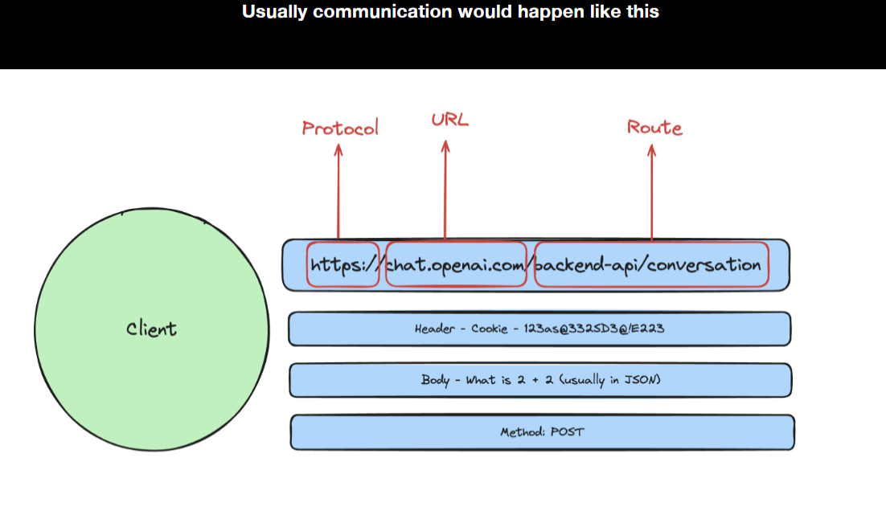
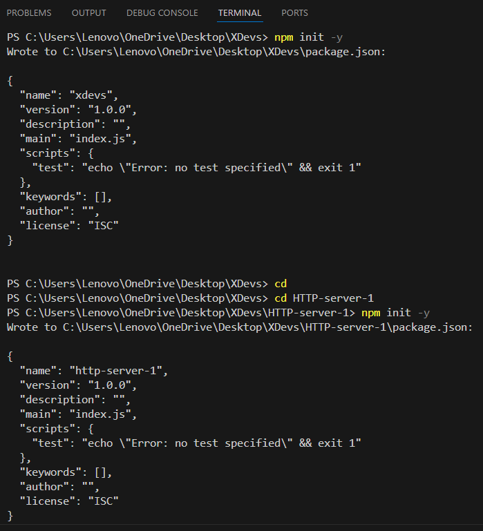

## Difference between static type and dynamic type language

## Advantages of JavaScript.
- Less Server Interaction: JavaScript can handle many tasks directly on the client side (in the browser) without needing to send requests to the server. This reduces server load, saves bandwidth, and makes applications faster since fewer round trips are needed to fetch data or perform operations.
- Immediate Feedback to Visitors: JavaScript can validate user inputs (like checking if a form is filled correctly) and show results immediately without waiting for a server response. This provides users with instant feedback, improving the user experience and making applications feel more responsive.
- High Interactivity: JavaScript makes it easy to create interactive elements on a web page, such as sliders, drag-and-drop items, or animations. This level of interactivity helps engage users, making web applications more dynamic and engaging.
- Richer Interfaces: JavaScript enables the development of complex interfaces with features like dropdowns, modals, auto-complete, and custom tooltips, enhancing usability. Libraries and frameworks like React, Angular, and Vue make it easier to build these advanced interfaces efficiently. 

## Disadvantage of javascript
- No support for Multithreading :- it operates on single threaded model means, it can  execute only one task at a time.
- No support for multiprocessing :- JavaScript can’t leverage multiple CPU cores directly to run different processes in parallel. This can limit performance for resource-heavy applications, especially on systems with multiple cores.
- Restricted file system access :- for security purpose javascript running in a web browser, it restricts access to the file system.While the File API allows limited access to user-selected files.
- Limited support for Networking Application :-  JavaScript in the browser has restricted network access. It can perform HTTP requests but lacks lower-level networking capabilities.
## Named function:
- The function which has named at the time of definition is called a named function. 
```js
function msg()  
{  
  console.log("Named Function");  
}  
msg();
```

## Client side and server side
- A client is a device, application, or software component that request and consumes services or resource from a server.
- A server is a device, Computer, or Software application that provides services, resources, or function to a client.

## Difference between var, Let and const.

- Scope:
- var: Function-scoped. Variables declared with var are function-scoped, meaning they are accessible throughout the function in which they are defined.
- let and const: Block-scoped. Variables declared with let and const are block-scoped, meaning they are only accessible within the block (enclosed by curly braces) where they are defined, such as a loop or an if statement.
- Hoisting:
- var: Hoisted. Variables declared with var are hoisted to the top of their containing function or global scope. This means you can access them before they are declared in the code, but they will be initialized with undefined.
- let and const: Hoisted but not initialized. Variables declared with let and const are also hoisted, but they are not initialized until their declaration statement is executed. Trying to access them before the declaration will result in a ReferenceError.
- Reassignment:
- var and let: Can be reassigned. Variables declared with var and let can be reassigned new values after their initial declaration.
- const: Cannot be reassigned. Variables declared with const are read-only and cannot be reassigned once they are given a value. However, it's important to note that for objects and arrays declared with const, their properties or elements can still be modified.
- Temporal Dead Zone (TDZ):
- var: Variables are not affected by the Temporal Dead Zone (TDZ) because they are hoisted and initialized with undefined.
- let and const: Variables declared with let and const are affected by the TDZ, which means you cannot access them before their declaration in the code.
- Global Object Property:
-var: Variables declared with var become properties of the global object (window in a browser or global in Node.js) if declared in the global scope.
-- let and const: Variables declared with let and const do not become properties of the global object when declared in the global scope.
## String Built in methods

```javascript
let myString = "Prince"
console.log(myString.length) // output 7
console.log(myString.toUpperCase) // output PRINCE
console.log(myString.chatAt('0')) // output p
console.log(myString.indexOf(P)) // output 0
console.log(myString.substring(0, 4)) // output Prin
console.log(myString.slice(0, 4)) // output Prin // it follows negative indexing also 
let newString = "   Prince   " 
console.log(newString.trim()) // output "Prince" // it removes extra spaces
let url = "https://PrinceKumar%20gmail.com"
console.log(url.replace('%20', '@'))// output: https://PrinceKumar@gmail.com
let url = "https://PrinceKumar%20gmail.com"
console.log(url.includes('sss')) // output: false 
// it search provided data inside given string if found then return true otherwise false
let name = "Prince Kumar"
console.log(name.split(' ')) // output: ["Prince","Kumar"]

// it separates the strings as per given data here we pass space so it separates by coma(,)where spaces are present.
```

## DOM(Document object model)
- It represent a web page as a tree like structure that allows javascript to dynamically access and manipulate the content and structure of a web page.

## Data-types 
- It determine type of a variable
-  Primitive 
     1. Numbers
     2. string 
     3. boolean
     4. undefined
     5. null
- non-primitive
     1. Object 
     2. array 
     3. function
     4. date
     5. Regexp

## Callbacks

```javascript
function square(n){
  return n*n;
}

function cube(n){
  return n*n*n;
}

function sumOfSquares(a,b){
  let square1 = square(a)
  let square2 = square(b)
  return square1 + square2;
}
function sumOfCubes(a,b){
  let cube1 = cube(a)
  let cube2 = cube(b)
  return cube1 + cube2;
}

let ans1 = sumOfSquares(1,2);
console.log(ans1);      // output : 5

let ans2 = sumOfCubes(1,2);
console.log(ans2);      // output : 9
```
- lets just understand the code and figure out the problem
- you can see that one of thing which we are violating here is DRY(Donot repeat yourself).
- instead we can do this make a generic function and call a function as a third parameter inside the generic function

```javascript
function square(n){
  return n*n;
}

function cube(n){
  return n*n*n;
}
function quad(n){
  return n*n*n*n;
}
// Generic function - Accepting a function as an argument
function sumOfSomething(a, b, callBackFn){
  let square1 = callBackFn(a)
  let square2 = callBackFn(b)
  return square1 + square2;
}
// Passing a function as an argumet 
let ans1 = sumOfSomething(1,2 , square);
console.log(ans1);      // output : 5

let ans2 = sumOfSomething(1,2 , cube);
console.log(ans2);      // output : 9

let ans3 = sumOfSomething(1,2, quad);
console.log(ans3)       // output : 17

```
- this is call back actully in which passing a function as an argument
> javascript is a single threading language
## Async function
What is async? - Asynchronous 
Your javascript thread doesn’t have access to everything immediately There are some tasks it needs to wait for 

For example -  
1. Reading a file 
2. Sending a network request 
3. A deliberate timeout

> lets assume there is a file in your sytem name a.txt the javascript dont have access to read the file. for that you use some js function to reda the file from system with the help of JS. and after that function other code functionalitty code also written. so if the file read system is taking two much time, the other functionality code is waiting for to execute in that scenario Async came into picture..

> Async call - for the time function filesystem taking file from system and reading the file do the other things.


```javascript
let a =1 ;
console.log(a);
fs.readFile("a.text", "utf-8", (err, data) => {
  console.log("data read from the file is ");
  console.log(data);
})
let ans = 0 ;
for(let i= 0 ; i<100; i++){
  ans= ans+i;
}
console.log(ans); 
```
goto http://latentflip.com/loupe/?code=Y29uc29sZS5sb2coImhpIik7CmZ1bmN0aW9uIG9uRG9uZSgpewogICAgY29uc29sZS5sb2coIkNsaWNrIHRoZSBidXR0b24iKQp9CgpzZXRUaW1lb3V0KG9uRG9uZSwgNTAwMCk7CmNvbnNvbGUubG9nKCJzc3RhY2sgY29tcGxldGVkIikK!!!PGJ1dHRvbj5DbGljayBtZSE8L2J1dHRvbj4%3D and runt the above given code to visualize the how javascript single threading call stack is working.

- here OnDone is not your own api, you are saying a api to complete the task for me and whenever task is completed let me know.
- Then here a big Question mark is coming what about if we create our own api.

```javascript
const fs = require ('fs')
function princeReadFile(callBack){
  fs.readFile("a.text", "utf-8", function(err , data){
    callBack(data);
  });
}
function onDone(data){
  console.log(data)
}
princeReadFile(onDone)
```
- but this is ugly of wwriting code, the function princeReadFile it is just a wrapper on top of another async function, which is fine. 
- Usually all async functions you will write will be on top of JS provided async function like settimeout and fs.readFile.
- the right way to write the code wiit the help of promises
## Promises
-  Just syntactical sugar.
- Just a more readable way to write async functions.
- Can you write JS without them Yes - Just use callbacks.
> cleaner way to write code with the help of Promise

```javascript
const fs = require ('fs')
function princeReadFile(){
  return new Promise(function(resolve){
    fs.readFile("a.txt", "utf-8", function(err , data){
      resolve(data);
    });
  });
}
function onDone(data){
  console.log(data)
}
princeReadFile().then(onDone);
```
> Promise tree


<text style="color:red ; font-size:20px ; font-weight:bold" > Basic Cmd command</Text>

- cd (Locate the current directory)
- cd fileName (Move to the file) 
- cd.. (One step back in folder tree)
- dir  (List of file available in current directory)
- mkdir fileName (create folder in currrent directory)
- vi (to read and write the file ) this one is quite complicated make a search before doing this.
-  move fileName.extension FolderName (use move file to another folder) (you can also move a folder to another Folder)
-  copy fileName.extension FolderName (use copy file one folder to another folder)


## Nodejs and it's runtime

> EcmaScript
- It is a scripting language specification on which javascript is based. or we can say this is the standard way to write javascript. 
- It serves as the guide line and rules fro scripting language design.
- here is the link https://tc39.es/ecma262/#sec-numbers-and-dates
>JavaScript
- It is scripting language that conforms the EcmaScript specification.
Ex - Date, var, let, const, function
- Apart from ES specfication it includes additional features that are not part of ES Like he document object model (DOM) manipulation, which is cricial for webdevelopment.
Ex -    setTimeout, fs.readFile
- generally every browser (V8 fro google chrome) has a engine which compile and run the JS code or we can say convert ot 0 & 1.
>Node.js
- it is runtime(something that can run javascript or compile javascript)
- Some smart people took out the V8 engine  
Added some Backend things (filesystem reads) on top 
to create a new runtime to compete with Backend languages 
like java
>Bun
- Other than the fact that JS is single threaded, Node.js is slow (multiple reasons for it) Some smart people said they wanted to re-write the JS runtime for the backend and introduced Bun.
- It is a significantly faster runtime 
 
- It is written in Zig
- https://github.com/oven-sh/bun
> HTTP(Hyper text transfer protocol)
- A protocol that is defined for machines to communicate..
- Specifically for websites, it is the most common way for your 
website’s frontend to talk to its backend.
A protocol that is defined for machines to communicate 
2. Specifically for websites, it is the most common way for your 
website’s frontend to talk to its backend

> What are the common methods you can send to your BE server? 
1. GET 
2. POST 
3. PUT 
4. DELETE
> What are the common status codes the backend responds with? 
1. 200 - Everything is ok 
2. 404 - Page/route not found 
3. 403 - Authentication issues 
4. 500 - Internal server error

And other status codes are also avaiable.
 > Ceating a HTTP Server 
1. select a folder in vs code nad open the developer shell
2. run the command [*npm init -y*]

 It will Create a file inside the folder name package.json 
 3. Create a new file inseide the folder index.js
 4. *npm install express* run this command to install express locally
```Javascript
> Index.js 
const express = require('express')
const port = 3000
const app = express();
// ti is similar to fs.readFile("path" , "utf-7" , ())
app.get('/prince/1', function(req, res){
    res.send({
        name: "prince", 
        age : 28
    })
  })

app.get('/', function(req, res){
  res.send('Hello World!')
})

app.listen(port)
```
5. **node Indexx.js**  Run this command and open **localhost:3000** in your browser .
6. there you can see the output **Hello World!**

