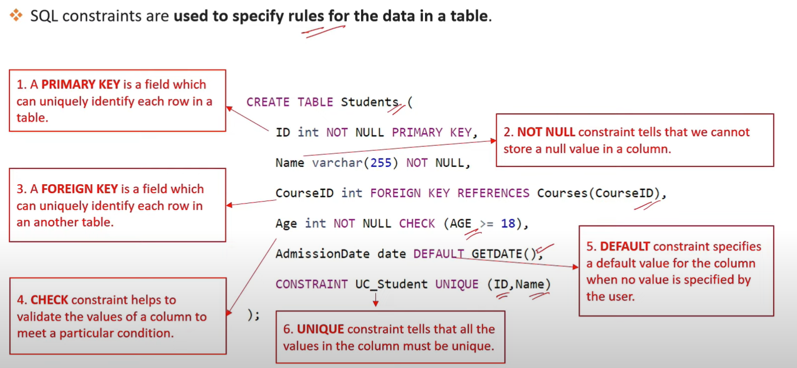
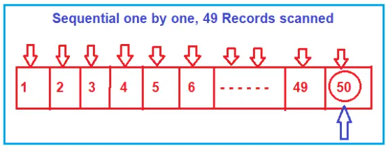
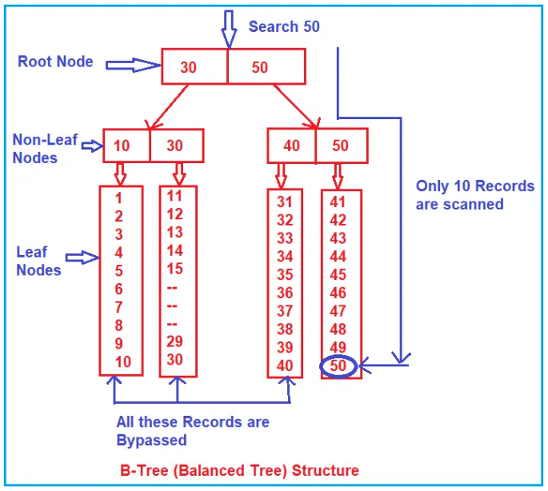

>  What is a database? 
- structured form of data storage in a computer or a collection of data in an organized manner and can be accessed in various ways. It is also the collection of schemas, tables, queries, views, etc. Databases help us with easily storing, accessing, and manipulating data held on a computer. The Database Management System allows a user to interact with the database.

> What is RDBMS:
- Relational Database Management Systems (RDBMS) are database management systems that maintain data records and indices in tables. Relationships may be created and maintained across and among the data and tables.
- In a relational database, relationships between data items are expressed by means of tables.

> Difference between DBMS and RDBMS?
- DBMS:
  - DBMS stores data as a file.
  - No relationship between data.
  - Normalization is not present in DBMS.
  - Deals with small amount of data.
  - Examples: XML
- RDBMS:
  - RDBMS stores data in a tabular form.
  - Data is stored in a table. which are related to each other.eg. foreign key relation.
  - Normalization is present in RDBMS.
  - Deals with large amount of data.
  - Examples: MySQL, PostgreSQL, SQL Server, Oracle, Microsoft access, etc.

> Explain DML, DDL, DCL and, TCL:
- DML(Data Manipulation language) 
    - used to retrieve, insert, update, and delete data in a database.
    - These are basic operations we perform on data such as selecting a few records from a table, inserting new records, deleting unnecessary records, and updating/modifying existing records.
    - **SELECT** – select records from a table.
    - **INSERT** – insert new records.
    - **UPDATE** – update/Modify existing records.
    - **DELETE** – delete existing records.
- **DDL(Data Definition Language)**
    - DDL statements are used to alter/modify a database or table structure.
    - **CREATE** – create a new Table, database, schema.
    - **ALTER** – alter the existing table, column description.
    - **DROP** – delete existing objects from a database.
- **DCL(Data Control Language)**
    - we will use these commands to secure database objects by creating roles, permissions using GRANT, REVOKE operations.
    - **GRANT** – allows users to read/write on certain database objects.
    - **REVOKE** – keeps users from the read/write permission on database objects.
- **TCL(Transactional control language)**
    - TCL is used to manage transactions within a database.
    - Examples: COMMIT, ROLLBACK, Begin Transaction statements.
    - **BEGIN Transaction** – opens a transaction.
    - **COMMIT Transaction** – commits a transaction.
    - **ROLLBACK Transaction** – ROLLBACK a transaction in case of any error.
> Difference between Drop Delete and Truncate Statement in SQL Server:
   - Delete:
     - The DELETE command is used to remove some or all rows from a table.
     - A WHERE clause can be used with a DELETE command to remove some specific rows from a table.
     - If the WHERE condition is not specified, then all rows are removed.
     - Delete Command is slower than Truncate.
   - Truncate:
     - TRUNCATE removes all rows from a table, but the table structure and its columns, constraints, indexes, and so on remain.
     - It does not require a WHERE clause, so we cannot filter rows while Truncating.
   - Drop:
     - The DROP command removes a table from the database.
     - All the related Data, Indexes, Triggers, Constraints, and Permission specifications for the Table are dropped by this operation.
> Difference between Primary key and unique key.
   - A table can have only one primary key. On the other hand, a table can have more than one unique key.
   - The primary key column does not accept any null values whereas a unique key column accepts one null value.


> Char, Varchar, Nchar, Nvarchar
> Char
- CHAR stores fixed-length data.
- It will store the data type in the Non-Unicode mechanism that means it will occupy 1byte for 1 character.
- The maximum length of the char data type is from 1 to 8000 bytes.
> VarChar
- It is a variable-length data type (dynamic data type) and will store the character in a non-Unicode manner that means it will take 1 byte for 1 character.
- The maximum length of the varchar data type is from 1 to 8000 bytes
> Nchar
- It is a fixed-length data type and will stores the characters in the Unicode manner that means it will take 2bytes memory per single character.
- The maximum length of nchar data type is from up to 4000bytes.
> Nvarchar(size/max) data type:
- It is a variable-length data type and will store the data type in the Unicode manner that means it will occupy 2bytes of memory per single character.
- The maximum length of nvarchar data type is from up to 4000 bytes.


> Copy data from one table to another table:
- When we copy the data from one table to another table then the two tables should contain the same structure.
- When we copy the data from one table to another table we use insert and select query. Tables always independent objects that mean a table does not depend on other tables.
  ```SQL
  INSERT <New table name> SELECT * FROM <Old Table Name>   
  ```

> By default, the primary key creates a unique clustered index on the column whereas a unique key creates a unique non clustered index.
> Normalization:
   - In relational database design the process of organizing data to minimize redundancy. Normalization usually involves dividing a database into two or more tables and defining relationships between the tables.
   - The objective is to isolate data so that additions, deletions, and modifications of a field can be made in just one table and then propagated through the rest of the database via the defined relationships.

> Different form of Normalization:
  1. **1NF (Eliminate repeating groups):** Make a separate table for each set of related attributes, and give each table a primary key. Each field contains at most one value from its attribute domain.
  2. **2NF (Eliminate Redundant Data):** If an attribute depends on only part of a multi-valued key, remove it to a separate table.
  3. **3NF (Eliminate Columns Not Dependent on Key):** If attributes do not contribute to a description of the key, remove them to a separate table. All attributes must be directly dependent on the primary key
  4. **BCNF (Boyce-Codd Normal Form):** If there are non-trivial dependencies between candidate key attributes, separate them out into distinct tables.
  5. **4NF (Isolate Independent Multiple Relationships):** No table may contain two or more 1:n or n:m relationships that are not directly related.


> denormalization:
- combining the data into one big table rather than going and fetching data from multiple tables.
- we are including data from one table to another table to reduce the number of joins in the query which helps in speeding up the performance.
- It is a database optimization technique where we can add redundant data to one or more tables and optimize the efficiency of the database.
> Disadvantages of Denormalization
- Due to data redundancy, it takes large storage.
- It is expensive to insert and update data in a table.
- It makes data inconsistency as data can be modified in several ways.


> Colation
- Set of rules that determine how data is stored and compared. Character data is sorted using rules that define the correct character sequence, with option for specifying case-sensitivity, accent marks, kana characters types, and character width.


> one-to-one, one-to-many and many-to-many relationships
1. The one-to-one relationship can be implemented as a single table and rarely as two tables with primary and foreign key relationships.
2. One-to-Many relationships are implemented by splitting the data into two tables with primary key and foreign key relationships.
3. Many-to-Many relationships are implemented using a junction table with the keys from both the tables forming the composite primary key of the junction table.

> NOLOCK:
- In SQL Server, NOLOCK is a table hint that allows you to read data without placing locks on the data you're reading. It’s like reading the data "as-is" without waiting for other transactions to finish, but with some risks.

> Real-life example:
- Imagine you're in a library, and someone is updating a book (maybe correcting a mistake in a page). Normally, you'd wait for the person to finish the update before reading the book so you get the correct, updated version.But if you're in a hurry, you could just grab the book and start reading while it's being updated. In this case, you might:See the old information before the update is done.Read a half-updated book (maybe one page is updated, but another isn't yet).
- This is what happens when you use NOLOCK in SQL Server. It reads the data "quickly," even if it's being updated. However, you might end up reading uncommitted or incomplete data, which can sometimes be incorrect.
  ```SQL
  SELECT * FROM Employees WITH (NOLOCK);
  ```
> Using NOLOCK in this query means:
- You can read the Employees table without waiting for other people to finish their updates. But, you risk reading uncommitted or inconsistent data, which could lead to wrong results.
- When to use:NOLOCK can be useful when you need fast access to data, and you're okay with the possibility of reading data that may not be fully accurate (e.g., for quick reports or analytics that don’t need 100% precision).

> UPDATE_STATISTICS
- This command is basically used when a large processing of data has occurred. If a large number of deletions any modification or Bulk Copy into the tables has occurred, it has to update the indexes to take these changes into account. UPDATE_STATISTICS updates the indexes on these tables accordingly.

> Constraint:
- It is use to specify the rules for the data inside the table. Limit to type of the data that can go into the table.
- 
- Type of constraints
    - Primary Key- Uniquiely identuify each roow in a table.
    - not Null- This constrints tell that we can not store a null value
    - foreign key- Uniquely identify each row in an another table.
    - Check- Helps to validate the values of a column to meet a particular condition.
    - Default - Defalt value into the column when no value is specified by the user.
    - Unique - All the values inside the column must be unique.

> Difference b/w primary & unique key.
- Primary Key:
    - Can not accept Null values.
    - Create Clustered index
    - One primary key in a table is possible.
- Unique key
    - Can Accept only one null value.
    - Creates non-clustered index.
    - More than one unique key possible in a table.

> Triggers & type off triggers
- Triggers are nothing but they are logic’s like stored procedures that can be executed automatically before the Insert, Update or Delete happens in a table or after the Insert, Update, or Delete happens in a table.
- There are two types of triggers. They are as follows:
- Types of triggers:
    1. DML Triggers – Data Manipulation Language Triggers.
        - Instead of Triggers:(Insert, uodate, Delete) The Instead Of triggers are going to be executed instead of the corresponding DML operations. That means instead of the DML operations such as Insert, Update, and Delete, the Instead Of triggers are going to be executed.
        - After Triggers:(Insert, uodate, Delete) The After Triggers fires in SQL Server execute after the triggering action. That means once the DML statement (such as Insert, Update, and Delete) completes its execution, this trigger is going to be fired.
    2. DDL Triggers – Data Definition Language Triggers
    3. CLR triggers – Common Language Runtime Triggers
    4. Logon triggers
> Example to understand trigger.
- lets consider we have table and there are some data present inside the table but now i want no one can insert any new data in this table. in this particular scenario we can use the trigger.
  ```SQL 
  CREATE TRIGGER trInsertEmployee 
  ON Employee
  FOR INSERT, UPDATE, DELETE
  AS
  BEGIN
    PRINT 'YOU CANNOT PERFORM THIS OPERATION'
    ROLLBACK TRANSACTION
  END
  ```
- Now if any one try to insert a data into the Employee table he/she get a message 'YOU CANNOT PERFORM THIS OPERATION' like this.
- This trigger is for Insert we can also make trigger for UPDATE & DELETE.
- for remove the function of trigger you can simply delete the trigger from the table folder structure.

> View: 
- it is a virtual table which consist of a subset of a data contained in a table or more than one table.
- Views do not store any data physically by default.
  ```SQL
  CREATE VIEW [IndiaEMPLOEE] AS
  SELECT Name, MobileNo
  FROM Employee
  WHERE Country= 'INDIA'
  ```

> Difference b/w Having & Where Clause.
- Where Clause
    - it is used before GROUP BY Clause
    - WHERE clause cannot be used with aggregate function
    - WHERE clause can be used with – Select, Insert, and Update statements
       ```SQL 
       SELECT Product, SUM(SaleAmount) AS TotalSales
       FROM Sales
       GROUP BY Product
       WHERE SUM(SaleAmount) > 1000
       ```
    - When we execute the above query it will give us the error as Incorrect syntax near the keyword ‘WHERE’. ,Here SUM is a Aggregate function.
- Having Clause
    - it is used after GROUP BY Clause
    - HAVING clause can be used with aggregate function
    - HAVING clause can only be used with the Select statement.

> Set Operators:
- The SET Operators in SQL Server are mainly used to combine the result of more than 1 select statement and return a single result set to the user.
    1. UNION: Combine two or more result sets into a single set, without duplicates.
    2. UNION ALL: Combine two or more result sets into a single set, including all duplicates.
    3. INTERSECT: Takes the data from both result sets which are in common.
    4. EXCEPT: Takes the data from the first result set, but not in the second result set (i.e. no matching to each other)

> Sub-Query/ Nested-Query/ Inner-Query
- Query within an another SQL query and embed within the WHERE clause. 
  ```SQL
  SELECT * FROM Employee WHERE name IN (SELECT name FROM UserDetails WHERE country='INDIA');
  ```

> Joins:
- used to combine two tables based on a related column between them.
> Types of join
- Inner Join
    - The Inner Join in SQL Server is used to return only the matching rows from both the tables involved in the join by removing the non-matching records.
      ```SQL
      SELECT Id as EmployeeID, Name, Department, City, Title as Project, ClientId
      FROM Employee 
      INNER JOIN Projects 
      ON Employee.Id = Projects.EmployeeId;
      ```
    we are using the EmployeeId column to check the similar values on the ON clause as both the tables having this column (Id in Employee table and EmployeeId in Projects table).

- Left Outer join
    - used to retrieve all the matching rows from both the tables involved in the join as well as non-matching rows from the left side table. In this case, the un-matching data will take a null value.
    - Left Outer Join will retrieve all the rows from the Left-hand side Table including the rows that have a null foreign key value in the right-hand side table.
      ```sql
      SELECT Id as EmployeeID, Name, Department, City, Title as Project, ClientId
      FROM Employee 
      LEFT OUTER JOIN Projects 
      ON Employee.Id = Projects.EmployeeId;
      ```
- LEFT JOIN
    ```SQL
    SELECT Id as EmployeeID, Name, Department, City, Title as Project, ClientId
    FROM Employee 
    LEFT JOIN Projects 
    ON Employee.Id = Projects.EmployeeId;
    ```
- Right Outer join:
  - used to retrieve all the matching rows from both the tables involved in the join as well as non-matching rows from the right-side table. In this case, the un-matching data will take NULL values.

> Index
- it is used to make search operation faster. retreive data very fast.
- they are similar to indexes at the start of the books, which purpose is to find a book quickly.
- Indexes make the search operation faster by creating something called a B-Tree (Balanced Tree) structure internally.
> Sequential Scan in Table:
- In Table Scan, the SQL Server Search Engine will search for the required information sequentially one by one from the start to the last record of the table. If the table has more rows, then it will take more time for searching the required data, so it is a time-consuming process.
- 
>  Balanced Tree (B-Tree) in SQL Server:
- Whenever you create an index (or indexes) on some column(s) of a table in SQL Server then what happens internally is, it creates a B-Tree structure. In the B-Tree structure, the data is divided into three sections i.e. Root Node, Non-Leaf Nodes, and Leaf Nodes.
- 
> Clustered Index
- The Clustered Index in SQL Server defines the order in which the data is physically stored in a table. In the case of a clustered index,  the leaf node store the actual data. As the leaf nodes store the actual data a table can have only one clustered index. The Clustered Index by default was created when we created the primary key constraint for that table. That means the primary key column creates a clustered index by default.

- When a table has a clustered index then that table is called a clustered table. If a table has no clustered index its data rows are stored in an unordered structure.

> Non-Clustered Index
- In SQL Server Non-Clustered Index, the arrangement of data in the index table will be different from the arrangement of data in the actual table. The data is stored in one place and the index is stored in another place. Moreover, the index will have pointers to the storage location of the actual data.

> StoredProcedure:
  - A SQL Server Stored Procedure is a database object which contains pre-compiled queries (a group of T-SQL Statements). In other words, we can say that the Stored Procedures are a block of code designed to perform a task whenever we called.
  - The stored procedure in SQL Server can accept both input and output parameters so that a single stored procedure can be used by several clients over the network by using different input data. The stored procedure will reduce network traffic and increase performance. If we modify the body of the stored procedure then all the clients who are using the stored procedure will get the updated stored procedure.
  - Whenever we execute a stored procedure in SQL Server, it always returns an integer status variable indicating the status, usually, zero indicates success, and non-zero indicates the failure.

> advantages of using a stored procedure in SQL Server
- Execution Plan Retention and Reusability
- Reduces the Network Traffic
- Code Reusability and Better Maintainability
- Better Security 


> Function:
- A function is a database object in SQL Server. Basically, it is a set of SQL statements that accept only input parameters, perform actions, and return the result. The function can return only a single value or a table. We can’t use the function to Insert, Update, and Delete records in the database table(s). 
- It is also a subprogram like a stored procedure that is defined for performing an action such as complex calculation and returns the result of the action as a value.
- These functions are created by the user or programmer.
- Functions are taking some parameters, do some processing, and returning some results back.
- Function can have the data is optional but function should return a value is mandatory.
> Types of user defined function:
- Scalar function
    - The functions which return a single value are known as scalar value function. The Scalar functions may or may not have parameters, but always return a single (scalar) value. The returned value can be of any data type, except text, ntext, image, cursor, and timestamp.
- Inline table-valued functions.
- Multi-statement table-valued functions.

> Difference between CHAR and VARCHAR data-types in SQL:
- CHAR is a fixed-length data type, while VARCHAR is a variable-length data type. 

> What is DDL (Data definition Language)
- used to define and manage all structures in a database. 
- DDL commands are primarily used to create, alter, and delete database objects such as tables, indexes, and schemas.

> What is DML (Data Manipulation Language):
- used for managing and manipulating data within database objects.
- Insert data or rows in a database
- Delete data from the database
- Retrieve or fetch data
- Update data in a database.

> What is Identity
- value is automatically created by the server. So, whenever you marked a column as identity, then that column will be filled in an auto-increment way by SQL Server. That means as a user we cannot insert a value manually into an identity column.
- Seed: Starting value of a column. The default value is 1.
- Increment: It specifies the incremental value that is added to the identity column value of the previous row. The default value is 1.
  ```sql
  Create Table Person
  (
       PersonId int identity(1, 1),
       Name nvarchar(20)
  )
  ```
> Explain transactions and how to implement it ?
- A transaction is a set of SQL statements that should be executed as one unit. That means a transaction ensures that either all of the command succeeds or none of them. If one of the commands in the transaction fails, all of the commands fail and any data that is modified in the database is rolled back.
- For example, if you are doing a back transaction i.e. transferring money from one account to another account. Then, in this case, there are two updates. One update is happening in the sender’s account from where the money is sending and the other update is happening in the receiver’s account who is receiving the money. Both of these two updates should either get committed or get rollback if there is an error. We don’t want the transaction to be in a half-committed state.

> When to use Group by ?
- GROUP BY clause in SQL helps organize data into groups. It’s useful when you want to summarize information, like finding totals, averages, or counts for each group of data.
- When we implement group by clause first the data of the table will be divided into the separate group as per the column and later aggregate function will execute on each group data to get the result. That means first Group By clause is used to divide similar types of data as a group and then an aggregate function is applied to each group to get the required results.
- If we use Group By Clause in a query, first the data in the table will be divided into different groups based on the column specified in the group by clause and then execute the aggregate function on each group to get the results.
  ```SQL 
  SELECT Department, COUNT(*) AS TotalEmployee
  FROM Employee 
  GROUP BY Department

  SELECT Department, TotalSalary = SUM(Salary) 
  FROM Employee 
  GROUP BY Department
  ```

> Can we select column which is not part of group by ?
- No, in SQL Server, you cannot directly select a column that is not part of the GROUP BY clause unless you apply an aggregate function to it.

> Aggregate Functions:
- An aggregate function in SQL is a function that performs a calculation on multiple rows of data and returns a single result. It’s commonly used with the GROUP BY clause to summarize data within groups.

> How can we sort records ?
- you can sort records using the ORDER BY clause. This clause lets you order the rows returned by a query based on one or more columns, either in ascending or descending order.
- By default, ORDER BY sorts records in ascending order.
  ```SQL
  SELECT * FROM Employee ORDER BY Name;           -- Ascending Order
  SELECT * FROM Employee ORDER BY Name ASC;       -- Ascending Order
  SELECT * FROM Employee ORDER BY Name DESC;      -- descending Order
  ```
> How can we remove duplicates ?
- you can remove duplicates from the result set using the DISTINCT keyword, which ensures that only unique rows are returned.
- The DISTINCT keyword eliminates duplicate rows based on the columns specified in the SELECT statement.
- If you have a table with duplicate product names and want to list each product only once:
  ```SQL
  SELECT DISTINCT ProductName
  FROM Products;

   --This will return each ProductName only once, even if it appears multiple times in the table.
  ```
- You can apply DISTINCT to multiple columns. In this case, it will return unique combinations of values for the specified columns.
  ```SQL
  SELECT DISTINCT ProductName, CategoryID
  FROM Products;
  SELECT DISTINCT ProductName, CategoryID
  FROM Products;

  --This returns each unique pair of ProductName and CategoryID, removing duplicates only if both values are the same across rows.
  ```

> Select the first top X records ?
- you can select the first top X records using the TOP keyword. This is useful when you only need a limited number of rows from your query results.
  ```SQL
  SELECT TOP 10 * FROM Employee; -- Top 10 records
  ```

> How to handle NULLS ?
- Handling NULL values in SQL is essential, as NULL represents missing or unknown data. 
- ways to manage Null values.
  1. Filtering Out NULL Values
       - Use IS NULL or IS NOT NULL in the WHERE clause to include or exclude NULL values in your results.
        ```SQL
        SELECT ProductID, ProductName, Price
        FROM Products
        WHERE Price IS NOT NULL;
        ```
  2. Replacing NULL Values with COALESCE() or ISNULL()
        - COALESCE returns the first non-NULL value in a list of columns or expressions.
        - ISNULL is SQL Server-specific and replaces a NULL value with a specified value.
        ```SQL
        SELECT ProductID, ProductName, COALESCE(Price, 0) AS Price
        FROM Products;
        ```
> What is use of wild cards ?
- 

> What is the use of Alias ?
- In SQL, an alias is a temporary name assigned to a table or column, making your query easier to read, especially when working with complex expressions or joining multiple tables.
    1. Renaming Columns
      - Aliases can simplify column names, especially useful for computed columns or when columns have long or confusing names.
        ```SQL
        SELECT ProductName, (Quantity * UnitPrice) AS TotalPrice
        FROM Products;
        ```

    2. Renaming Tables
      - Table aliases shorten table names, making them easier to reference, especially with joins.
        ```SQL
        SELECT c.CustomerName, o.OrderID
        FROM Customers AS c
        JOIN Orders AS o ON c.CustomerID = o.CustomerID;
        ```
> How to write a case statement ?
- A CASE statement in SQL is used to create conditional logic in queries, allowing you to return different values based on specified conditions. It’s similar to an IF-ELSE structure in programming.
- Simple CASE Statement
  ```SQL
  SELECT column1,
         CASE column_name
             WHEN value1 THEN result1
             WHEN value2 THEN result2
             ...
             ELSE default_result
         END AS alias_name
  FROM table_name;
  -- Example
  SELECT ProductName,
  CASE
      WHEN Price > 20 THEN 'Expensive'
      ELSE 'Affordable'
  END AS ProductCategory
  FROM Products;
  ```
- Search CASE Statement - Suppose you have an Orders table with a column StatusID representing different statuses, and you want to display a text label based on each StatusID.
  ```SQL
  SELECT column1,
         CASE 
             WHEN condition1 THEN result1
             WHEN condition2 THEN result2
             ...
             ELSE default_result
         END AS alias_name
  FROM table_name;
  -- Example
  SELECT OrderID, 
         CASE StatusID
             WHEN 1 THEN 'Pending'
             WHEN 2 THEN 'Shipped'
             WHEN 3 THEN 'Delivered'
             ELSE 'Unknown Status'
         END AS OrderStatus
  FROM Orders;
  ```
- Searched CASE Statement- Let’s say you have a Products table and you want to categorize products based on their Price range.
  ```SQL
  SELECT ProductName, Price,
         CASE 
             WHEN Price < 50 THEN 'Budget'
             WHEN Price BETWEEN 50 AND 100 THEN 'Standard'
             WHEN Price > 100 THEN 'Premium'
             ELSE 'Not Specified'
         END AS PriceCategory
  FROM Products;
  ```
> What is self-reference tables ?
- A self-referencing table (also known as a self-join table) is a table that contains a foreign key linking back to its own primary key, allowing rows within the same table to have a hierarchical or parent-child relationship.
  ```SQL
  SELECT e.EmployeeName AS Employee, 
         m.EmployeeName AS Manager
  FROM Employees e
  LEFT JOIN Employees m ON e.ManagerID = m.EmployeeID;
  ```

> What is self-join ?
- A self-join is a join operation where a table is joined with itself. This technique is commonly used when you need to compare rows within the same table or when you need to work with hierarchical or recursive data.
  ```SQL
  SELECT e.EmployeeName AS Employee, 
         m.EmployeeName AS Manager
  FROM Employees e
  LEFT JOIN Employees m ON e.ManagerID = m.EmployeeID;
  ```
> Explain the between clause ?
- The BETWEEN clause in SQL is used to filter data within a specified range. It’s commonly used in the WHERE clause to select rows where a column’s value falls between two boundaries, which can be numeric, text, or date values. The BETWEEN clause is inclusive, meaning it includes both the lower and upper boundary values.
  ```SQL
  SELECT column1, column2, ...
  FROM table_name
  WHERE column_name BETWEEN value1 AND value2;

  -- EXAMPLE

  SELECT ProductName, Price
  FROM Products
  WHERE Price BETWEEN 50 AND 150;
  ```
> Can inner Subquery return multiple results ?
- Yes, an inner subquery in SQL can return multiple results, depending on its usage and the context in which it’s used. However, the way these results are handled depends on the type of query and the operator used with the subquery.
- If you’re using a subquery in a WHERE clause with operators like IN, ANY, or ALL, it can return multiple rows (but only one column).
- This type of subquery is common when filtering based on a list of values.
  ```SQL
  -- Suppose you have two tables, Orders and Customers, and you want to find orders from specific customers.
  -- EXAMPLE
  SELECT OrderID, CustomerID, OrderDate
  FROM Orders
  WHERE CustomerID IN (SELECT CustomerID FROM Customers WHERE Country = 'USA');
  ```
> What is Co-related Query ?
- A correlated subquery is a type of subquery in SQL that references a column from the outer query. Unlike a regular subquery, which runs independently of the outer query, a correlated subquery is executed once for each row processed by the outer query. Because it relies on the outer query’s values, it evaluates on a row-by-row basis.
- Key Points of Correlated Subqueries
    - Dependency on Outer Query: A correlated subquery references columns from the outer query, making it dependent on the outer query’s current row.
    - Row-by-Row Evaluation: The subquery is evaluated once for each row in the outer query, so it’s often slower for large datasets.
    - Used in Filtering or Calculating: Correlated subqueries are commonly used to filter data based on other tables or to perform calculations for each row.
      ```SQL
      SELECT column1, column2, ...
      FROM table1 AS outer_table
      WHERE columnX operator (
          SELECT aggregate_function(column)
          FROM table2 AS inner_table
          WHERE inner_table.columnY = outer_table.columnZ
      );
      -- EXAMPLE
      SELECT EmployeeName, Salary, DepartmentID
      FROM Employees e
      WHERE Salary > (
          SELECT AVG(Salary)
          FROM Employees
          WHERE DepartmentID = e.DepartmentID
      );
      ```
> Differentiate between Joins and Subquery ?
- Joins and subqueries are both methods used in SQL to combine and retrieve data from multiple tables. While they can often achieve similar results, they work differently and are suitable for different use cases.
  - Definition and structure:
    - Join: Combines rows from two or more tables based on a related column between them. Joins create a result set that merges data from multiple tables side-by-side.
    - Subquery: A query nested inside another query (e.g., within SELECT, FROM, or WHERE clauses). The subquery runs first, and its result is used by the outer query.
  - Performance
    - Join: Generally more efficient than subqueries for large datasets, as SQL engines are optimized for join operations. Joins work directly on the tables, especially when indices are used, making them faster in many cases.
    - Subquery: Can be slower, especially when used as correlated subqueries, since they may execute for each row in the outer query. However, for certain filtering and aggregation tasks, subqueries can be simpler and more readable.
  - Use Cases
    - Join: Used when you need to combine columns from multiple tables and display them together. Joins are particularly helpful for queries that require merging data from related tables.Example: Listing customer details along with their orders.
    - Subquery: Useful when you need to filter or aggregate data based on values from another table without displaying that table’s columns in the final output.

> Find NTH Highest Salary in SQL.
- you can find the N-th highest salary by using the ROW_NUMBER() or DENSE_RANK() window functions. These functions are efficient and work well with SQL Server.
1. Using ROW_NUMBER()
    - The ROW_NUMBER() function is commonly used to assign a unique row number to each result, based on the   specified ordering. This approach will work well if you want to get a distinct ranking, where ties are not considered as a single rank.
      ```SQL  
       WITH SalaryRanking AS ( 
        SELECT Salary, ROW_NUMBER() OVER (ORDER BY Salary DESC) AS RowRank  
        FROM Employees  
      )
        SELECT Salary
        FROM SalaryRanking
        WHERE RowRank = N;
      ```
      - The ROW_NUMBER() function assigns a unique rank (RowRank) to each salary in descending order.
      - The outer query selects the salary where RowRank equals the desired rank N.
      - Replace N with the rank you need (e.g., 2 for the second-highest, 3 for the third-highest).
2. Using DENSE_RANK()
    - If you want to consider duplicate salaries as the same rank (for example, if there are two employees with the highest salary), use DENSE_RANK() instead. This will assign the same rank to duplicate values and skip no ranks.
      ```SQL
      WITH SalaryRanking AS (
          SELECT Salary, DENSE_RANK() OVER (ORDER BY Salary DESC) AS Rank
          FROM Employees
      )
      SELECT Salary
      FROM SalaryRanking
      WHERE Rank = N;
      ```
      - DENSE_RANK() ranks salaries in descending order, assigning the same rank to duplicate salaries.
      - This is useful if you want to treat tied salaries as the same rank without skipping ranks.
      - Replace N with the rank you want to retrieve.
> Select the top nth highest salary using correlated Queries?
- To find the N-th highest salary using a correlated subquery in SQL Server, you can compare each salary with a subquery that counts how many distinct salaries are greater than the salary in question. This approach leverages the correlation between the outer and inner queries to filter results based on rankings.
  ```SQL
  SELECT DISTINCT Salary
  FROM Employees e1
  WHERE (
      SELECT COUNT(DISTINCT Salary)
      FROM Employees e2
      WHERE e2.Salary > e1.Salary
  ) = N - 1;  -- N is the rank you are looking for
  ```
> Performance comparison of all the method
  - Using ROW_NUMBER() or DENSE_RANK()
    - Speed: Generally fast, especially for large datasets, because SQL Server optimizes window functions.
    - Execution Plan: Efficient use of sorting and indexing; the query plan is optimized for performance.
    - Use Case: Recommended for scenarios with distinct salaries or when ranks need to account for duplicates.
        ```SQL
        WITH SalaryRanking AS (
            SELECT Salary, ROW_NUMBER() OVER (ORDER BY Salary DESC) AS RowRank
            FROM Employees
        )
        SELECT Salary
        FROM SalaryRanking
        WHERE RowRank = N;
        ```